# Report write up for GDSC Pack and Ship

> [!NOTE]
> gdsc{unp4ck1n6_b1n4r135_15_n4u6h7y}
## Introduction

In this challenge, we had to bypass a password check in a packed binary to extract the flag.

## Getting started 

### Getting the string data
First ran the command `string` to get the all the string in the file 
so that if password is not encrypted we can get that 
```shell
strings release
```

there is the output that [I got](resources/stringdata.txt) but I did not find the password so i can assumed that it's encrypted.
but got a very good lead for future use that the given binary is packed using `UPX`

```txt
This file is packed with the UPX executable packer http://upx.sf.net
```
### First attempt  Buffer overflow

A buffer overflow occurs when a program writes more data into a buffer than it can hold, leading to memory corruption. This can sometimes be exploited to overwrite function return addresses, change program execution flow, or even achieve arbitrary code execution.
We can check the binary if it is vulnerable to buffer overflow by providing large `password`

``` bash
python3 -c 'print("A" * 100)' | ./release
```

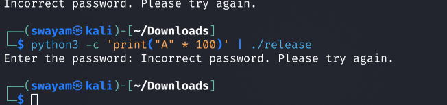

but it did not worked it seams the input function is not vulnerable to buffer or there are other measure to prevent that.

## Second attempt Decompilation of a Binary
Decompilation is the process of converting a compiled binary (machine code) back into a higher-level representation, usually resembling the original source code. This is useful for reverse engineering, security analysis, and debugging.

I tried to decompile the binary in **`assembly`** by using **`Radare2`**

```shell
r2 -aa release # to open the binary in r2
```

and getting the all the function using `afl` the is the  [data](resources/without_upd.txt) of what i thought is main function seeing the below output
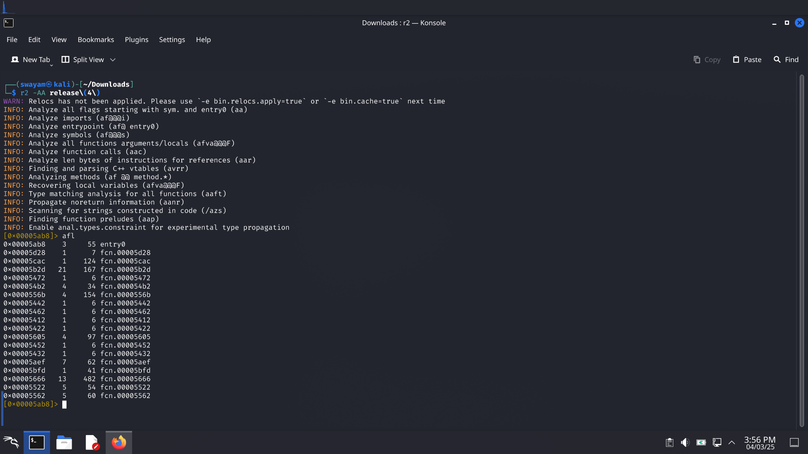
but only using this I was unable to make the required connections to check which function did what to i tried to unpack the binary using `UPX`

```shell
upx -d release 
```

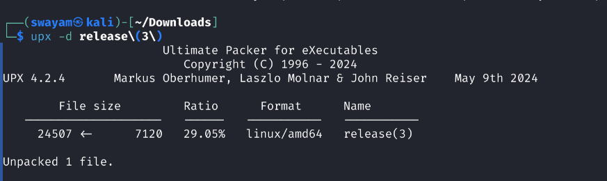

now if we check the binary using `r2` and get all the present function I get [data](resources/with_upd.txt)

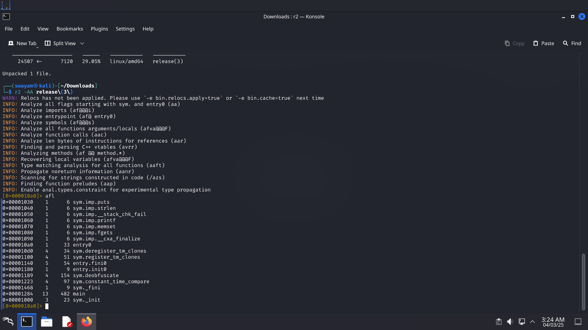

now we can see the names of the where as before it was just the memory location

now I  checked the binary using `iaito` a GUI for `r2`

we get the full call stack of the given binary
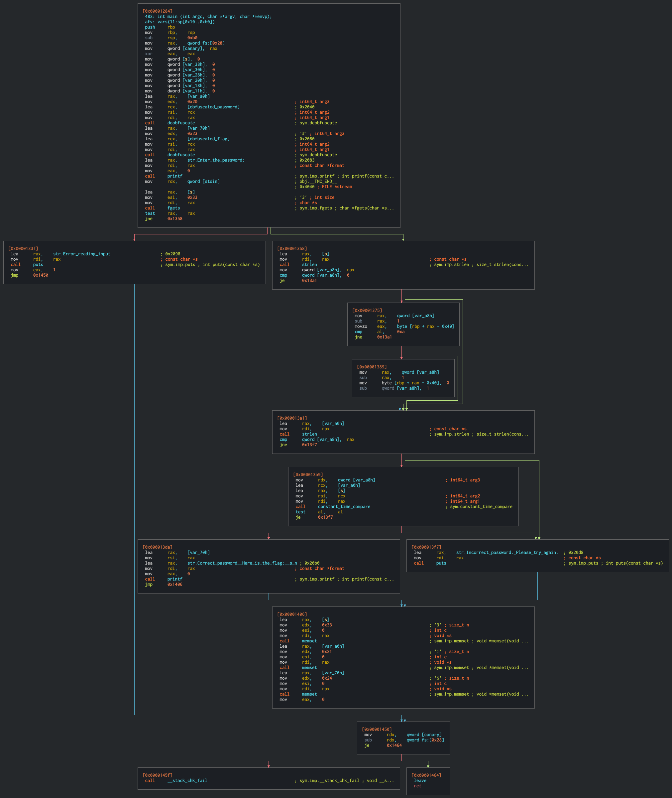

Now if check the main function and search for `password` we get 

### main function


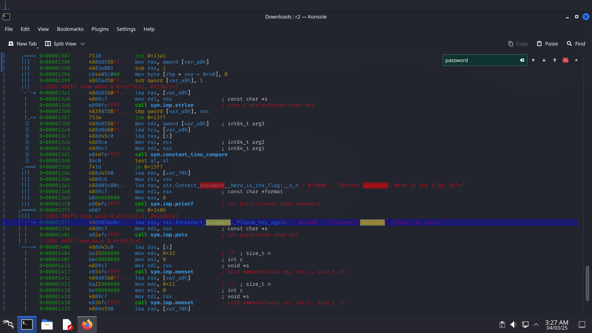

as we can see the call stack the jump conditions at `0x000013b0 and 0x000013d86which the jmp condition to incorrect password statement

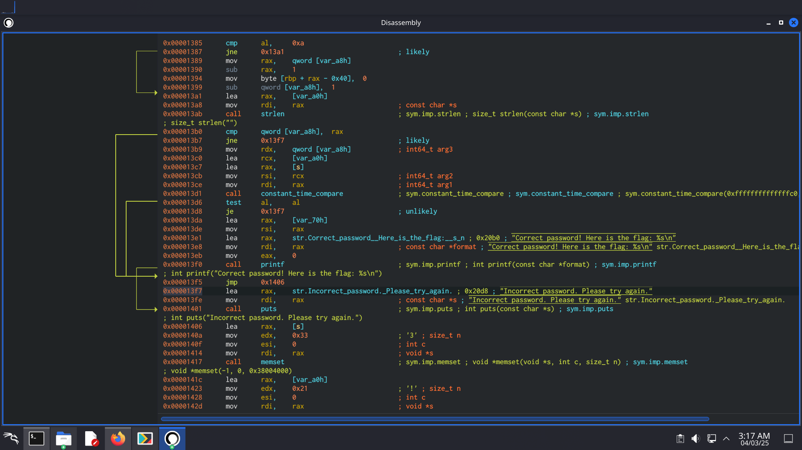

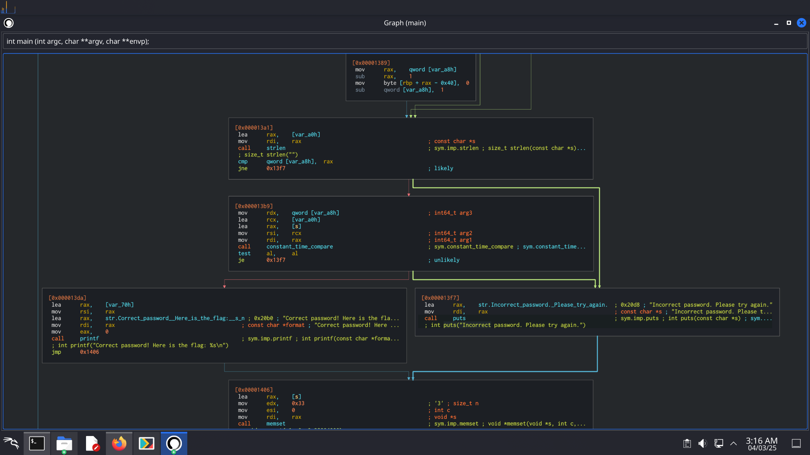

Now if we look at `0x000013b0`
```asm
0x000013b0 cmp qword[var_a8h], rax ;compare valur at var_a8h with rax
0x000013b7 jne 0x13f7              ;Jump to 0x13f7 if they are not equal
```

The compare statement is comparing the length of input string with the length of the password if they did not match it will jump to `0x000013f7` this is the fist condition we have to over come

Now if we look at `0x000013d1`

```asm
0x000013d1 call constant_time_compare
0x000013d6 test al, al
0x000013d8 je 0x13f7
```

the function call at `0x000013d1`  **`call constant_time_compare`**
- Calls the function `constant_time_compare`, which is typically used for secure comparisons (e.g., cryptographic operations) to prevent timing attacks.

`test al, al`
- This checks whether `AL` is zero (`AL == 0`).
- The `test` instruction performs a bitwise AND between `AL` and itself, updating the Zero Flag (ZF) without changing `AL`.

**`je 0x13f7` (Jump if Equal / Zero)**
- If `AL == 0` (meaning the comparison failed), execution jumps to `0x13f7`.
- Otherwise, it continues to the next instruction.

## How to bypass the security 
If we want the `Flag` we need to bypass these security checks for that we can modify the assembly or get the function  signature of `sys.deobfuscate`  which we can get 

```shell
r2 -aa release
afl
pad @ sys.deobfuscate
```

and we have to get the encoded password or flag we can decode both that we can get 
this is from the out put of the [main function](resources/with_upd.txt)
`password ` at `0x000012e1`
```password
"1\xd0A\u01c0\xd4\b+\xe2J\x87\xf1\x9c'\x1f\xd1\r\xdd\xf8\xa2\x10\"\xf0.\xf8\x83\x95a\xce,\xc34\xc0\n\u047a\x90\x13#\x90\x1a\xd9\xf0\x8bK\f\xc6H\xdc\xf5\x97L`\x91&\x83\xf4\xba\x13g\xd1O\xda\xf6\x9c"
```

and the `flag` at `0x000012fc`
```flag

"4\xc0\n\u047a\x90\x13#\x90\x1a\xd9\xf0\x8bK\f\xc6H\xdc\xf5\x97L`\x91&\x83\xf4\xba\x13g\xd1O\xda\xf6\x9c"
```

---

But in this case I have gone with the modification of the decompiled assembly
for that we have to open the binary in write mode in `r2`
```shell
r2 -w release 
```

first I tried to overwrite the jump condition at `0x000013b7` to point at the where the system call for printing the flag at `0x00013de`

```shell
s 0x000013b7
wa jmp 0x13de
```

but i got segmentation fault 
> [!BUG]
> image

then I tried to overwrite the jump condition at `0x000013b7` and `0x000013d8` to `nop` finally that worked

```shell 
s 0x000013b7
wa nop
s 0x000013d8
wa nop
```
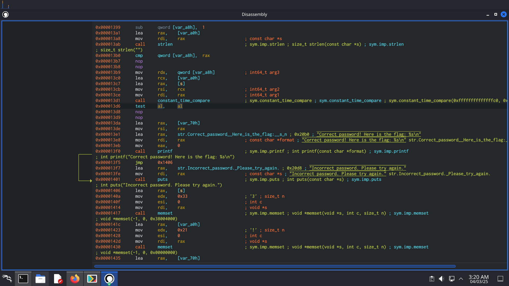

now if check the flow of program we get

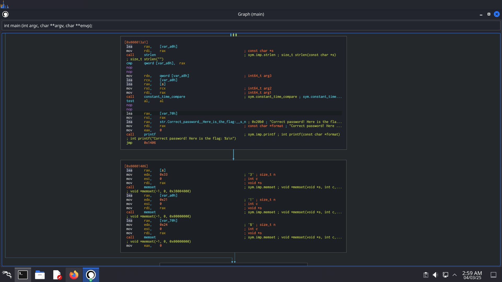

Now we check the whole program and its control flow we get 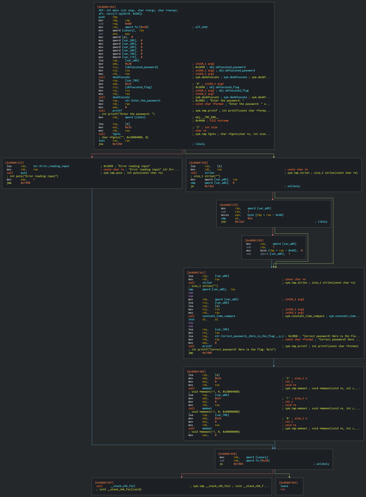
